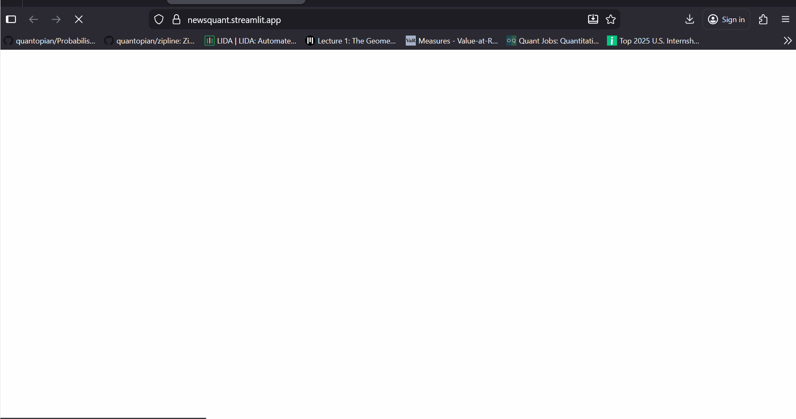

📰 NewsQuant: Event-Driven Sentiment Engine

An NLP pipeline that quantifies the impact of breaking news on asset prices using DuckDuckGo Search and LLM Inference.

🚀 Context

Price action is often driven by qualitative events that don't appear in a spreadsheet. NewsQuant bridges the gap between unstructured text data and quantitative price moves. It fetches live headlines, scores them using a Large Language Model, and visualizes the "Net Sentiment" alongside price history.

⚙️ The Pipeline

Ingestion: Scrapes real-time financial news using duckduckgo-search (bypassing fragile Yahoo Finance APIs).

Processing: Batches headlines and feeds them to Llama-3 via Groq.

Inference:

Task 1: Classify sentiment (POSITIVE, NEGATIVE, NEUTRAL).

Task 2: Generate a "Market Pulse" summary explaining why the stock is moving.

Visualization: Overlays sentiment distribution and a color-coded news feed onto the dashboard.

⚡ Key Features

Robust Scraper: Uses DuckDuckGo for high-reliability news fetching.

Sentiment Meter: Calculates a weighted "Bullish/Bearish" score based on the aggregate news flow.

AI Market Pulse: Auto-generates a text summary of the news cycle, saving analysts from reading dozens of articles.

Multi-Asset Support: Dynamically handles queries for Stocks, Crypto, and Indices.

🛠️ Tech Stack

NLP Engine: Groq (Llama-3)

Search: DuckDuckGo Search (ddgs)

Frontend: Streamlit

Data: yFinance (Price History)

📦 Installation

git clone [https://github.com/yourusername/NewsQuant.git](https://github.com/yourusername/NewsQuant.git)
pip install -r requirements.txt
streamlit run app.py
